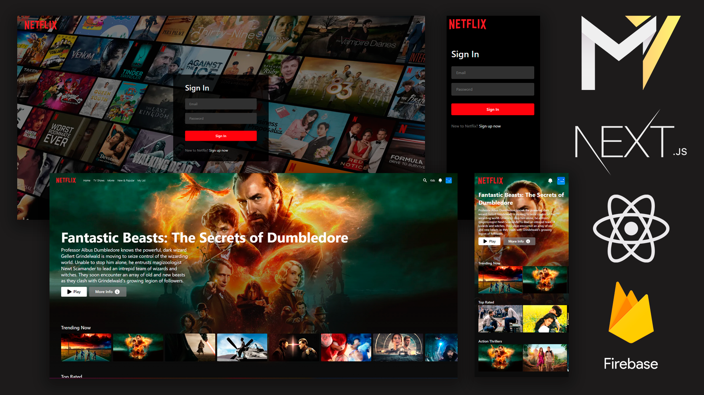
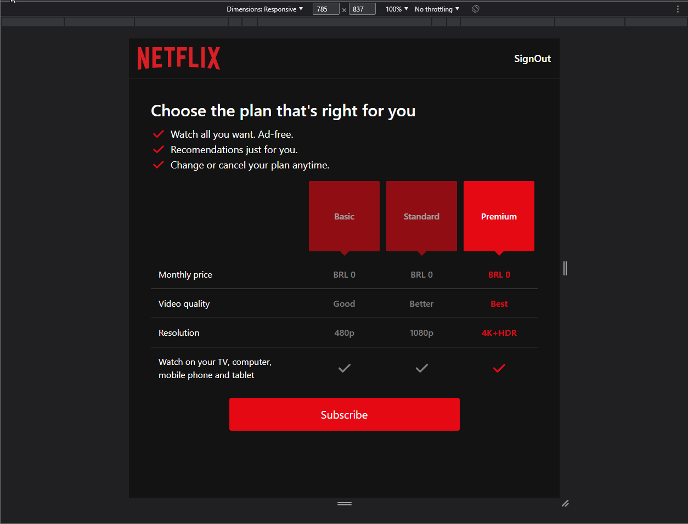

  <a style="color:#F806CC;font-weight:bold" href="#Projeto">Projeto</a>&nbsp;&nbsp;&nbsp;|&nbsp;&nbsp;&nbsp;
  <a style="color:#F806CC;font-weight:bold" href="#Desenvolvimento">Desenvolvimento</a>&nbsp;&nbsp;&nbsp;|&nbsp;&nbsp;&nbsp;
  <a style="color:#F806CC;font-weight:bold" href="#Features">Features</a>&nbsp;&nbsp;&nbsp;|&nbsp;&nbsp;&nbsp;
  <a style="color:#F806CC;font-weight:bold"
  href="#Extras">Extras</a>&nbsp;&nbsp;&nbsp;

#  ⚡**Projeto**

Aplicação web clone do Netflix (plataforma de streaming) desenvolvida com **Next.js** para fins de aprendizado.

 

#  ⚙️**Desenvolvimento**

🔸Projeto desenvolvido com a metodologia Mobile-Frist portanto é totalmente responsivo. 
🔸Alem do design, foram replicadas algumas funcionalidades como Login e Inscrição de usuário onde foi integrado a API **Stripe** como método de pagamento através de sua extensão no Firebase (tecnologia utilizada para desenvolvimento do back-end). O método de pagamento foi totalmente integrado com a aplicação inclusive os cancelamento de inscrição e adição de protudos (Planos mensais). 
🔸Também foi desenvolvida a funcionalidade "My List" onde o usuário pode adicionar um título a uma lista itens favoritos facilitando o acesso, essa funcionalidade foi feita de forma semelhante a aplicacão original. 
🔸API utilizada para o conteúdo dos vídeos - <a scr="https://www.themoviedb.org/"><b>The MovieDB</b></a>

### **Linguagens**:

Typescript | HTML | CSS

### **Tecnologias**:

React(Next.js) | Tailwind CSS | Firebase

### **Principais bibliotecas**:

RecoilJs | React-Hot-Toast | MaterialUI | HeroIcons | React-Hook-Form

## **Testando o projeto**

➡️ Para testar a aplicação acesse o <a src="https://netflix-clone-study.vercel.app/login">**_LINK_**</a>  
🔺Crie uma conta no botão **Sign up now** 
🔺Utilize um cartão de teste da **Stripe** Uitlize o exemplo a seguir ou confira no <a src="https://stripe.com/docs/testing">**_LINK_**</a>  
ex:[ 4242424242424242 ] 
🔺**Confira o conteúdo...**
 

# **Features**:

#### **✅Sistema de login**

#### **✅Sistema de inscrição de usuário e Gateway de pagamento**

#### **✅Sistema de Favoritos ("My List")**

#### **✅Conteúdo TheMovieDB**

#### **✅Responsividade**

 

# **Extras**

